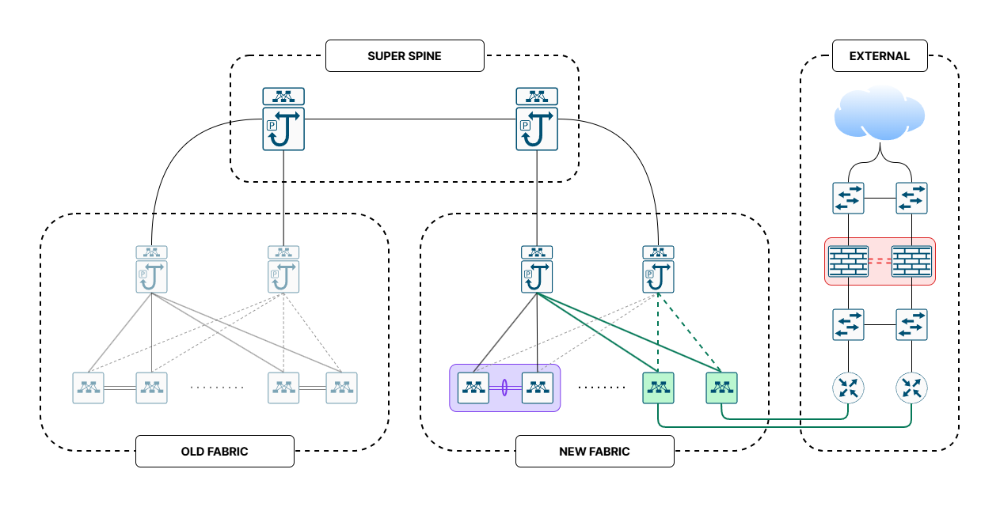

# RAPA Final Project

Navia 클라우드 멀티테넌트 데이터센터 패브릭 확장 프로젝트 저장소입니다. 문서, 토폴로지 이미지, PNETLab 프로젝트 파일, 장비 최종 설정, 백업 자동화 코드를 분리해서 관리합니다.

## Repository Layout

```text
rapa-final-project/
├── README.md
├── docs/
│   └── RFP.md
├── images/
│   └── topology.png
├── pnet-project/
│   └── FINAL-LAB.zip
├── configs/
│   ├── FB-1/
│   ├── FB-2/
│   ├── SSP/
│   └── EXT/
└── automation/
    └── backup/
```

## Categories

| 분류 | 경로 | 내용 |
|---|---|---|
| 문서 | `docs/` | RFP, 설계/검토 문서 |
| 이미지 | `images/` | 프로젝트 토폴로지 이미지 |
| PNETLab | `pnet-project/` | PNETLab 프로젝트 압축 파일 |
| 장비 설정 | `configs/` | 장비별 최종 `.config` 파일 |
| 백업 자동화 | `automation/backup/` | Ansible 기반 구성 백업 템플릿 |
| 프로젝트 안내 | `README.md` | 저장소 구조와 주요 산출물 안내 |

## Key Files

- [RFP 문서](docs/RFP.md)
- [토폴로지 이미지](images/topology.png)
- [PNETLab 프로젝트 파일](pnet-project/FINAL-LAB.zip)
- [장비 설정](configs/)
- [백업 자동화 README](automation/backup/README.md)

## Topology



PNETLab에서 직접 확인할 수 있는 프로젝트 파일은 [`pnet-project/FINAL-LAB.zip`](pnet-project/FINAL-LAB.zip)에 있습니다.

## Device Configs

장비 설정 파일은 역할/구간별 폴더 아래에서 관리합니다.

- `configs/FB-1/`: FB 건물 1번 장비 설정
- `configs/FB-2/`: FB 건물 2번 장비 설정
- `configs/SSP/`: Super Spine 장비 설정
- `configs/EXT/`: 외부 연동 장비 설정

## Backup Automation

백업 자동화 코드는 `automation/backup/` 아래에 있습니다. NX-OS와 IOS 장비의 `running-config`를 텍스트 파일로 저장한 뒤 `copy running-config startup-config`를 실행하고 결과를 로그로 남기는 템플릿입니다.

```bash
cd automation/backup
ansible-galaxy collection install -r requirements.yml
ansible-playbook backup_all.yml
```

실제 장비 정보와 계정은 `automation/backup/inventory.ini`의 템플릿 값을 환경에 맞게 교체해서 사용합니다.
